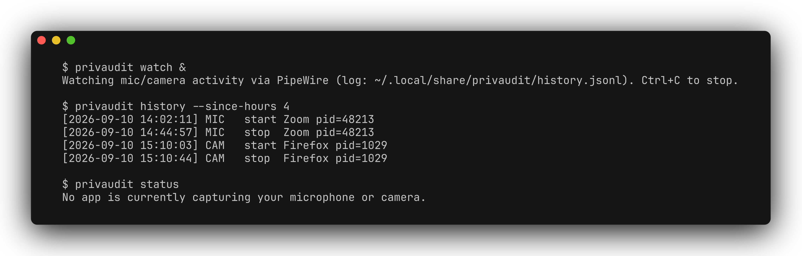

# privaudit

[](https://github.com/zhuhroscar-tech/privaudit/actions/workflows/ci.yml)
[](https://github.com/zhuhroscar-tech/privaudit/releases)


Local mic/camera access history for Linux — the missing piece Android's
"privacy dashboard" and macOS's [OverSight](https://objective-see.org/products/oversight.html)
already give you, that no DE-agnostic Linux equivalent provides.

## Simple explanation

Keeps a private log on your own computer of every time an app used your
microphone or camera, so you can check afterward whether anything you
didn't expect turned them on. Nothing leaves your machine and nothing is
muted, blocked, or reconfigured — it just tells you what happened.

## The problem

Android has had a mic/camera privacy dashboard (with a 7-day history) since
Android 12. macOS has OverSight, which logs every camera/microphone
activation with the responsible process. **Linux has neither, built-in or
otherwise, across desktop environments.** PipeWire (the default audio/video
stack on Fedora, Ubuntu 22.10+, Arch, and most rolling distros) *can* tell
you what's using your mic/camera right now (`pactl list source-outputs`,
`pw-dump`), but there is no standard way to see what already happened after
the fact — you have to be watching at the exact moment. If you step away
from your desk, or just want to confirm nothing quietly grabbed your mic
during a call, there's nothing to check.

## What this does



`privaudit watch` polls PipeWire's object graph every 2 seconds (configurable)
and appends a JSON-lines event whenever an app starts or stops actively
capturing your microphone or camera. `privaudit history` queries that log
after the fact, with filters by kind, app name, or time window. `privaudit
status` shows what's capturing right now, without needing the watcher
running.

**Read-only.** privaudit never mutes, blocks, disconnects, or reconfigures
any audio/video stream, never touches PipeWire config, and never requires
root. Its only write is appending lines to its own log file
(`~/.local/share/privaudit/history.jsonl` by default).

## Install

Requires Python 3.9+ and PipeWire (specifically the `pw-dump` CLI tool,
shipped with `pipewire` on virtually every current distro — Fedora, Ubuntu
22.10+, Arch, Debian 12+, openSUSE Tumbleweed, and any distro that has
switched from PulseAudio). PulseAudio-only systems are not currently
supported (privaudit detects and reports this clearly rather than failing
silently).

```bash
pip install --user privaudit   # once published to PyPI
```

Or grab the standalone `.pyz` from a GitHub Release (no pip/venv needed):

```bash
curl -LO https://github.com/zhuhroscar-tech/privaudit/releases/latest/download/privaudit.pyz
python3 privaudit.pyz --help
```

Or from source:

```bash
git clone https://github.com/zhuhroscar-tech/privaudit.git
cd privaudit
pip install --user .
```

### Run automatically at login (optional)

```ini
# ~/.config/systemd/user/privaudit.service
[Unit]
Description=privaudit mic/camera access logger

[Service]
ExecStart=%h/.local/bin/privaudit watch
Restart=on-failure

[Install]
WantedBy=default.target
```

```bash
systemctl --user enable --now privaudit.service
```

## Usage

```bash
privaudit watch                          # start logging (foreground; Ctrl+C to stop)
privaudit watch --interval 5             # poll every 5s instead of the default 2s
privaudit status                         # what's capturing right now
privaudit history                        # full recorded history
privaudit history --kind mic             # mic events only
privaudit history --app zoom             # filter by app name/binary substring
privaudit history --since-hours 24       # last 24 hours
privaudit history --json                 # machine-readable
```

## Uninstall

```bash
pip uninstall privaudit
rm -rf ~/.local/share/privaudit   # deletes the recorded history
```

## Privacy & permissions

privaudit is *itself* a privacy tool, so it holds itself to the same bar it
watches for: no network access, no telemetry, ever. The only data it stores
is on your own disk (`~/.local/share/privaudit/history.jsonl`) — application
names, PIDs, and timestamps of mic/camera capture start/stop events, nothing
about the audio/video content itself (privaudit never opens `/dev/video*` or
any audio device — it only reads PipeWire's object graph metadata). No root
required.

## Distro / architecture support

Pure Python (stdlib only) — any Linux distribution and architecture running
PipeWire with `pw-dump` on PATH. Not currently supported: PulseAudio-only
systems (older Debian/Ubuntu LTS releases before the PipeWire switch),
BSD/non-Linux platforms.

## Reproducible build & test

```bash
git clone https://github.com/zhuhroscar-tech/privaudit.git
cd privaudit
python3 -m venv .venv && . .venv/bin/activate
pip install -e . pytest
pytest -v
python -m build
python -m zipapp build/pyz-deps -m "privaudit.cli:main" -o dist/privaudit.pyz
```

CI (`.github/workflows/ci.yml`) runs the same steps on real Ubuntu Linux
GitHub Actions runners with `pipewire`/`pipewire-pulse`/`wireplumber`
installed, including a smoke test of the installed console script and the
standalone `.pyz` against the runner's real `pw-dump`.

## License

MIT — see [LICENSE](LICENSE).
